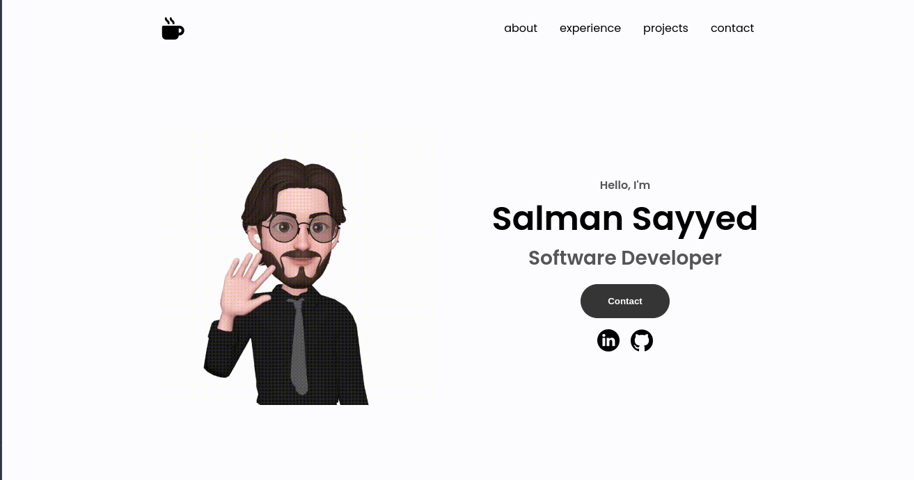
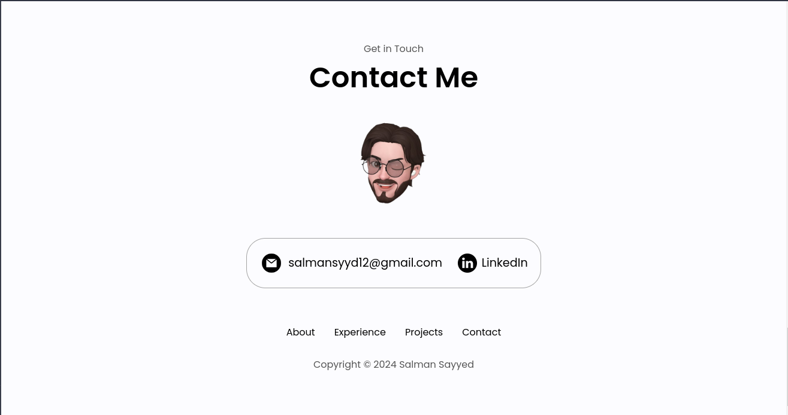

# Static Portfolio 

Built with HTML, CSS and Javascript and deployed on github pages

## Screenshot's 





## Installation
Clone the repository locally
```bash
git clone https://github.com/gh0stfrk/portfolio
```
Change directory into the cloned repository
```bash
cd portfolio
```
Start a web server in python 
```bash
python3 -m http.server 5000
```

